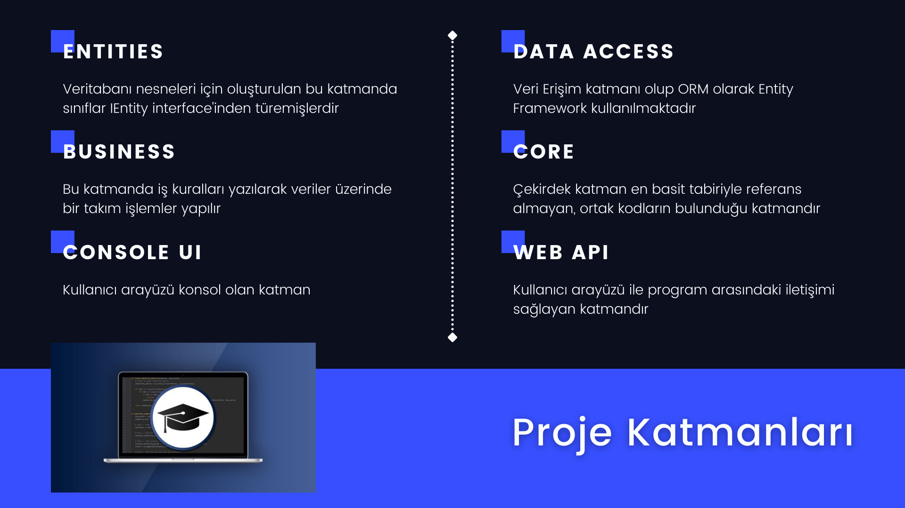
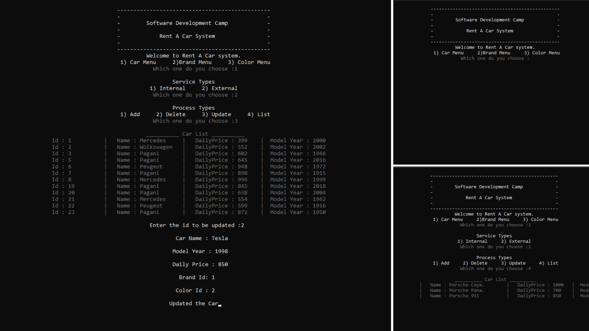

# Araç Kiralama Sistemi

<p align="center">
	</img>
</p>


<b>Herkese merhaba!</b>  <p>Bu repo Yazılım Geliştirici Yetiştirme Kampı'nda yapılan çalışmaları kapsayan Araç Kiralama Projesidir. Genel olarak proje katmanlı mimariye uygun şekilde tasarlanıp ORM olarak entity framework kullanılmaktadır. Kullanıcı arayüzü olarak konsol uygulaması belirlenmiştir.</p>
<br>
<p><b>Gelin hep beraber katmanlarımızı tanıyalım</b></p>
<p align="center">
	</img>
</p>

## Kullanımı

Öncelikle terminale gelin ve aşağıdaki komutları girin :

```bash
# Repository klonlayın
$ git clone https://github.com/AbdullahOztuurkk/Rent-A-Car-Project.git

# Klonladığınız klasöre gidin
$ cd Rent-A-Car-Project.git

# Bağımlılıkları yükleyin
$ dotnet restore
```
## Ekran Görüntüleri
<br>
<p align="center">
	</img>
</p>
<br>

## Technologies Used 

- [Entity Framework](https://reactjs.org/)
- [FluentValidation](https://www.apollographql.com/docs/react/get-started/)
- [ConsoleTableExt](https://github.com/minhhungit/ConsoleTableExt)

## Developer
#### Abdullah Öztürk
🧧 [Medium](https://abdullahozturkk.medium.com/)

💻 [Linkedin](https://www.linkedin.com/in/abdullah-ozturk/)

💬 [Discord](AbdullahOztuurkk#5200)

🎫 [Email](mailto:oabdullahozturk@yandex.com.tr)
