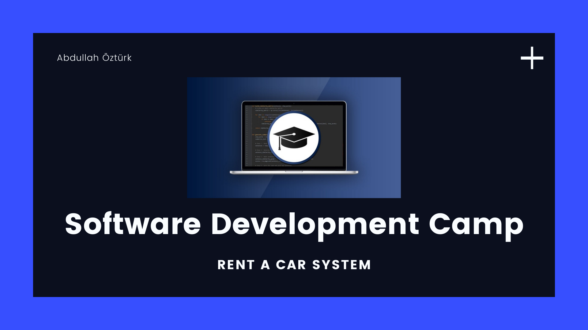
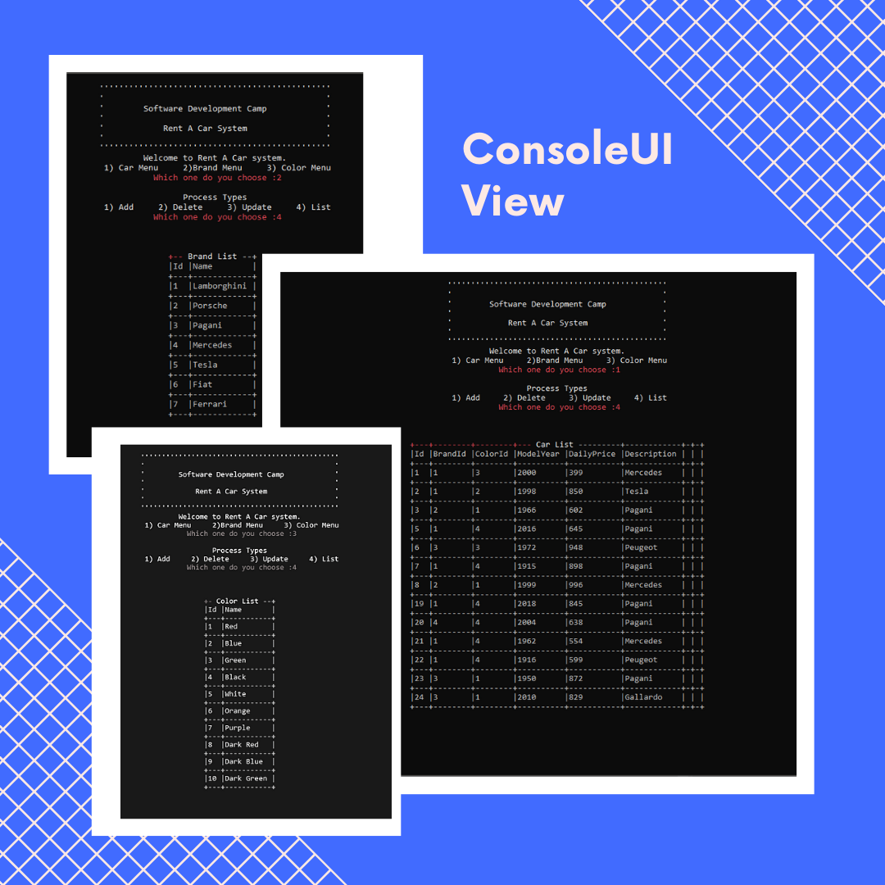

# Rent A Car System

<p align="center">
	</img>
</p>


<b>Hello Everyone!</b>

<p>It is a car rental project developed during the Software Development Camp. In general, the project was designed in accordance with the layered architecture and the entity framework is used as the ORM. Console application is determined as the user interface. </p>
<br>

## How To Use

First, open the terminal and enter below commands:

```bash
# Clone the repository
$ git clone https://github.com/AbdullahOztuurkk/Rent-A-Car-Project.git

# Go to project folder
$ cd Rent-A-Car-Project

# Install Dependencies
$ dotnet restore
```
## Screenshots

&nbsp;
<p align="center">
	</img>
</p>
&nbsp;

## Used Technologies

- [Entity Framework](https://entityframework.net/)
- [FluentValidation](https://fluentvalidation.net/)
- [ConsoleTableExt](https://github.com/minhhungit/ConsoleTableExt)
